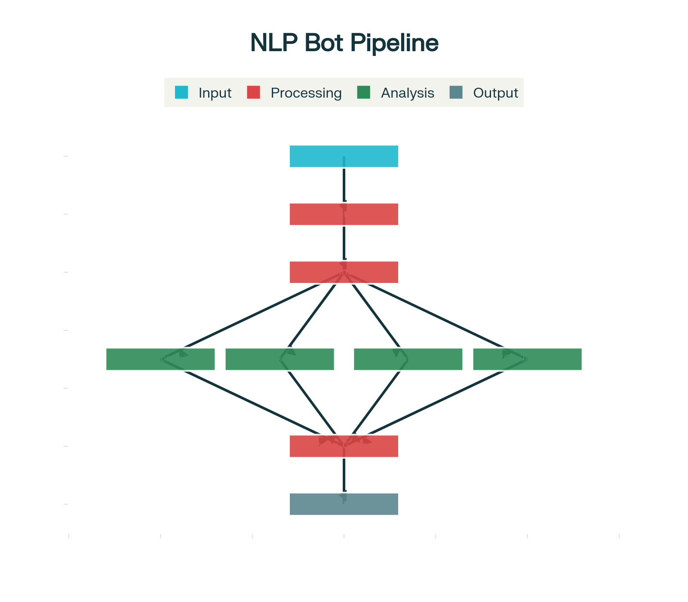

# 🤖 NLP Chatbot - Advanced AI Assistant

A sophisticated web-based chatbot featuring real-time Natural Language Processing (NLP) analysis, multiple AI personalities, and an interactive dashboard for understanding language processing.



## Table of Contents
- [Features](#-features)
- [Getting Started](#-getting-started)
- [Project Structure](#-project-structure)
- [Technical Architecture](#-technical-architecture)
- [NLP Features Deep Dive](#-nlp-features-deep-dive)
- [AI Personalities](#-ai-personalities)
- [API Documentation](#-api-documentation)
- [User Interface Features](#-user-interface-features)
- [Customization](#-customization)
- [Development Guide](#-development-guide)
- [Contributing](#-contributing)
- [Usage Examples](#-usage-examples)
- [Browser Compatibility](#-browser-compatibility)
- [License](#-license)

## ✨ Features

### 🎭 Multiple AI Personalities
- **ARIA** (👩‍💼) - Professional Assistant with formal, business-focused responses
- **NOVA** (🎨) - Creative Companion offering artistic and imaginative interactions
- **SAGE** (🔬) - Analytical Expert providing data-driven, logical insights
- **ECHO** (😊) - Friendly Helper with casual, warm conversational tone

### 🧠 Real-time NLP Analysis
- **Sentiment Analysis** - Visual gauge showing emotional tone with real-time feedback
- **Intent Recognition** - Identifies user intentions (greeting, question, request, etc.)
- **Entity Extraction** - Detects people, places, organizations, and dates
- **Part-of-Speech Tagging** - Breaks down grammar components
- **Text Transformations** - Shows past/future tense and negation variants

### 🎨 Modern UI/UX
- Dark theme with glassmorphism effects
- Responsive design for all devices
- Real-time typing indicators
- Character count and input validation
- Interactive settings panel

## 🚀 Getting Started

### Prerequisites
- Modern web browser (Chrome, Firefox, Safari, Edge)
- No server setup required - runs entirely in the browser

### Installation

1. **Clone the repository**
   ```bash
   git clone https://github.com/yourusername/Chatbot-with-NLP.git
   cd Chatbot-with-NLP
   ```

2. **Open in browser**
   ```bash
   # Simply open index.html in your web browser
   open index.html
   # or
   python -m http.server 8000  # For local server
   ```

3. **Start chatting!**
   - Select your preferred AI personality
   - Type a message and watch the real-time NLP analysis
   - Explore the interactive dashboard

## 📁 Project Structure

```
Chatbot-with-NLP/
├── index.html                 # Main HTML structure with semantic markup
├── style.css                  # Comprehensive design system with dark theme
├── app.js                     # Core JavaScript application logic
├── README.md                  # This comprehensive documentation
└── nlp_pipeline_flowchart.png # NLP processing visualization diagram
```

### File Overview

- **[`index.html`](index.html)** - Semantic HTML5 structure with accessibility features
- **[`style.css`](style.css)** - Modern CSS design system with CSS custom properties
- **[`app.js`](app.js)** - Main [`NLPChatbot`](app.js) class with full application logic
- **[`nlp_pipeline_flowchart.png`](nlp_pipeline_flowchart.png)** - Visual NLP pipeline diagram

## 🔧 Technical Architecture

### Frontend Stack
- **HTML5** - Semantic markup structure with ARIA attributes
- **CSS3** - Modern styling with CSS custom properties and dark theme
- **Vanilla JavaScript** - Core application logic with ES6+ features
- **Compromise.js** - Advanced NLP processing library

### Key Components

#### [`NLPChatbot`](app.js) Class
Main application controller handling:
- Message processing and response generation
- Personality switching and management
- NLP analysis coordination
- UI state management

#### Design System ([`style.css`](style.css))
- Comprehensive CSS custom properties
- Dark/light theme support with automatic detection
- Responsive grid layouts
- Component-based styling with BEM methodology

## 🧠 NLP Features Deep Dive

### Sentiment Analysis
```javascript
// Real-time sentiment scoring (-1 to +1)
const sentiment = this.calculateBasicSentiment(text);
// Visual feedback with emoji indicators
this.updateSentimentIndicator(sentiment);
```

**Features:**
- Real-time processing as you type
- Visual feedback with emoji indicators and gauge display
- Scoring range from -1 (very negative) to +1 (very positive)
- Applications in mood detection and response tone adjustment

### Intent Recognition
Detects user intentions across multiple categories:
- **Greeting**: Hello, hi, good morning
- **Question**: What, how, why, when, where
- **Request**: Please help, can you, I need
- **Complaint**: Bad, terrible, frustrated
- **Compliment**: Great, awesome, excellent
- **Learning**: Teach me, explain, what is
- **Help**: Assist, support, guide

### Entity Extraction
Identifies and categorizes important information:
- **Person**: Names, individuals, pronouns
- **Place**: Cities, countries, locations
- **Organization**: Companies, institutions
- **Date**: Times, dates, temporal expressions

### Part-of-Speech Analysis
Grammatical breakdown of text:
- **Nouns**: People, places, things
- **Verbs**: Actions, states
- **Adjectives**: Descriptive words
- **Adverbs**: Modifiers

### Text Transformations
Dynamic text modifications:
- **Past Tense**: Convert present to past
- **Future Tense**: Convert to future form
- **Negation**: Apply negative form

## 🎭 AI Personalities

### ARIA - Professional Assistant
- **Use Case**: Business communication, formal interactions
- **Response Style**: Structured, efficient, professional
- **Best For**: Work-related queries, formal documentation, business analysis
- **Example**: "Excellent! It's a pleasure to meet you, Sarah. How may I assist you with your professional needs regarding your quarterly report today?"

### NOVA - Creative Companion  
- **Use Case**: Creative projects, brainstorming, artistic endeavors
- **Response Style**: Imaginative, inspiring, artistic
- **Best For**: Creative writing, design ideas, artistic inspiration
- **Example**: "Alex! What a beautiful name! I'm so excited to create and explore ideas together. What inspires you?"

### SAGE - Analytical Expert
- **Use Case**: Data analysis, logical reasoning, technical explanations
- **Response Style**: Methodical, detailed, evidence-based
- **Best For**: Research, technical questions, analytical tasks
- **Example**: "An intriguing inquiry, Jordan. Let me break this down methodically..."

### ECHO - Friendly Helper
- **Use Case**: Casual conversation, emotional support, general assistance
- **Response Style**: Warm, conversational, approachable
- **Best For**: Daily chat, emotional support, friendly advice
- **Example**: "Hey Sam! Great to meet you, friend! What's on your mind today?"

## 📚 API Documentation

### NLPChatbot Class

#### Constructor
```javascript
const chatbot = new NLPChatbot();
```

#### Core Methods

##### `analyzeText(text: string): AnalysisResult`
Performs comprehensive NLP analysis on input text.

**Parameters:**
- `text` (string): Input text to analyze

**Returns:** `AnalysisResult` object containing:
```javascript
{
  sentiment: {
    score: number,      // -1 to 1
    emotion: string,    // Emoji representation
    positiveWords: number,
    negativeWords: number
  },
  intents: {
    [intentName]: confidence  // 0 to 1
  },
  entities: Array<{
    text: string,
    type: string
  }>,
  posTags: Array<{
    text: string,
    pos: string,
    category: string
  }>,
  transformations: {
    past: string,
    future: string,
    negative: string
  }
}
```

##### `switchPersonality(personality: string): void`
Changes the active AI personality.

**Parameters:**
- `personality` (string): One of 'ARIA', 'NOVA', 'SAGE', 'ECHO'

##### `sendMessage(): void`
Processes and sends user message, generating appropriate response.

#### Configuration Properties

##### `personalities`
Object defining available AI personalities with their characteristics:
```javascript
this.personalities = {
  "ARIA": {
    name: "ARIA",
    title: "Professional Assistant",
    avatar: "👩‍💼",
    greeting: "Good day! I'm ARIA...",
    traits: ["formal", "efficient", "business-oriented"]
  }
  // ... other personalities
};
```

##### `intents`
Object mapping intent types to keyword arrays for recognition.

##### `sentimentWords`
Object containing positive and negative sentiment dictionaries.

## 🎨 User Interface Features

### Responsive Design
- **Mobile-First**: Optimized for all screen sizes
- **Adaptive Layout**: Grid adjusts to screen width  
- **Touch-Friendly**: Large interactive elements

### Dark Theme
- **Modern Aesthetic**: Sleek dark interface with glassmorphism
- **Eye Comfort**: Reduced eye strain for extended use
- **Automatic Detection**: Respects system preferences

### Real-time Feedback
- **Typing Indicators**: Shows AI is "thinking"
- **Character Counter**: Input length tracking (0/500)
- **Sentiment Preview**: Live emotion indicators

### Interactive Dashboard
- **Collapsible Panels**: Hide/show analysis sections
- **Visual Gauges**: Sentiment meter with needle animation
- **Progress Bars**: Intent confidence levels
- **Tag Clouds**: Entity and POS visualization

## 🔧 Customization

### Adding New Personalities
```javascript
// In app.js, extend the personalities object
this.personalities["CUSTOM"] = {
    name: "CUSTOM",
    title: "Custom Assistant",
    description: "Your custom personality description",
    avatar: "🎯",
    greeting: "Custom greeting message",
    traits: ["trait1", "trait2"]
};
```

### Styling Customization
```css
/* In style.css, modify CSS custom properties */
:root {
  --color-primary: #your-color;
  --color-background: #your-background;
}
```

### Adding New NLP Features
```javascript
// 1. Extend analyzeText method
analyzeText(text) {
  const analysis = {
    // ... existing analysis
    customFeature: this.analyzeCustomFeature(text)
  };
  return analysis;
}

// 2. Add analysis method
analyzeCustomFeature(text) {
  // Custom NLP logic
  return result;
}

// 3. Add UI update method
updateCustomFeatureDashboard(data) {
  // Update dashboard display
}
```

## 🏗️ Development Guide

### Architecture Overview
```
NLPChatbot
├── Core Logic (app.js)
├── Styling (style.css)  
├── Markup (index.html)
└── Dependencies (compromise.js CDN)
```

### Development Setup

#### Prerequisites
```bash
# Modern browser with ES6+ support
# Text editor (VS Code recommended)
# Optional: Local web server
```

#### Quick Start
```bash
# Clone repository
git clone <repository-url>

# Open in editor
code Chatbot-with-NLP

# Serve locally (optional)
python -m http.server 8000
# or
npx serve .
```

### Code Style Guidelines

#### JavaScript
```javascript
// Use ES6+ features
const chatbot = new NLPChatbot();

// Descriptive method names
generatePersonalityResponse(intent, sentiment, message) {
  // Implementation
}

// Clear variable names
const sentimentScore = analysis.sentiment.score;

// Comments for complex logic
// Calculate normalized sentiment score based on word frequency
const normalizedScore = Math.max(-1, Math.min(1, score / Math.max(words.length / 3, 1)));
```

#### CSS
```css
/* Use CSS custom properties */
:root {
  --color-primary: #2563eb;
  --spacing-base: 16px;
}

/* BEM methodology for classes */
.message-bubble {
  /* Component styles */
}

.message-bubble--user {
  /* Modifier styles */
}
```

### Performance Optimization

#### JavaScript Optimization
```javascript
// Debounce input handling
const debouncedAnalysis = debounce(this.analyzeText, 300);

// Efficient DOM manipulation
const fragment = document.createDocumentFragment();
// Add elements to fragment, then append once

// Memory management
this.conversationHistory = this.conversationHistory.slice(-100);
```

## 🤝 Contributing

We welcome contributions! Here's how to get involved:

### Development Process

#### Setting Up Development Environment
```bash
# Fork and clone
git clone https://github.com/yourusername/Chatbot-with-NLP.git
cd Chatbot-with-NLP

# Create feature branch
git checkout -b feature/your-feature-name

# Make changes and test
# No build process required - edit files directly

# Commit and push
git add .
git commit -m "Add: your feature description"
git push origin feature/your-feature-name
```

### Code Standards

- **JavaScript**: Use ES6+ syntax, camelCase naming, JSDoc comments
- **CSS**: Follow BEM methodology, use CSS custom properties
- **HTML**: Use semantic markup, include ARIA attributes

### Testing Requirements
- [ ] Test in Chrome, Firefox, Safari, Edge
- [ ] Verify responsive design (320px to 1440px+)
- [ ] Check accessibility with screen reader
- [ ] Validate HTML and CSS
- [ ] Test all interactive features

### Contribution Ideas

#### Beginner-Friendly
- Fix typos in documentation
- Improve CSS animations
- Add new color themes
- Enhance error messages

#### Intermediate
- Implement new NLP features
- Add personality customization
- Create new UI components
- Improve accessibility

#### Advanced
- Integrate machine learning models
- Add voice recognition
- Implement real-time collaboration
- Create plugin system

## 💡 Usage Examples

### Educational Conversations

**User**: "Teach me about NLP"

**Response**: "NLP (Natural Language Processing) is how computers understand and process human language! I use techniques like sentiment analysis to understand emotions, entity extraction to identify important things like names and places, and intent recognition to understand what you want to do. Think of NLP as giving computers the ability to read between the lines!"

### Sentiment Analysis Examples

**Input**: "I absolutely love this amazing new feature!"
- **Sentiment Score**: +0.85
- **Emotion**: 😄
- **Analysis**: Strong positive sentiment with words "absolutely," "love," and "amazing"

**Input**: "This is terrible and frustrating."
- **Sentiment Score**: -0.72
- **Emotion**: 😢
- **Analysis**: Strong negative sentiment with "terrible" and "frustrating"

### Entity Extraction Examples

**Input**: "I'm meeting John Smith at Apple headquarters in Cupertino tomorrow."
- **Person**: John Smith
- **Organization**: Apple
- **Place**: Cupertino, headquarters
- **Date**: tomorrow

### Text Transformation Examples

**Original**: "I am writing a book."
- **Past Tense**: "I was writing a book."
- **Future Tense**: "I will be writing a book."
- **Negated**: "I am not writing a book."

## 📊 Browser Compatibility

| Browser | Support | Notes |
|---------|---------|-------|
| Chrome 90+ | ✅ Full | Recommended |
| Firefox 88+ | ✅ Full | Fully supported |
| Safari 14+ | ✅ Full | Works great |
| Edge 90+ | ✅ Full | Chromium-based |

## ⚙️ Settings & Configuration

### Response Speed
- **Fast**: 0.5 second delay
- **Normal**: 1 second delay  
- **Slow**: 2 second delay

### Analysis Display
- **Toggle NLP Dashboard**: Show/hide analysis panel
- **Real-time Updates**: Live analysis as you type

### Accessibility
- **Keyboard Navigation**: Full keyboard support
- **Screen Reader**: Compatible with assistive technology
- **High Contrast**: Clear visual hierarchy
- **Focus Indicators**: Clear focus states

## 🐛 Debugging

### Common Issues
```javascript
// NLP library not loaded
if (typeof nlp === 'undefined') {
  console.warn('Compromise.js not loaded, using fallback analysis');
}

// DOM elements not found
const element = document.getElementById('targetId');
if (!element) {
  console.error('Element not found:', 'targetId');
  return;
}

// Browser compatibility
if (!CSS.supports('backdrop-filter', 'blur(10px)')) {
  // Fallback styling
}
```

## 🗺️ Roadmap

- [ ] Voice input/output integration
- [ ] Multi-language support
- [ ] Advanced ML model integration
- [ ] Chat history persistence
- [ ] Custom training capabilities
- [ ] API integration options
- [ ] Plugin system for extensibility
- [ ] Real-time collaboration features

---

**Made with ❤️ for the open source community**

*This project demonstrates the power of modern web technologies combined with natural language processing to create engaging, intelligent conversational interfaces.*